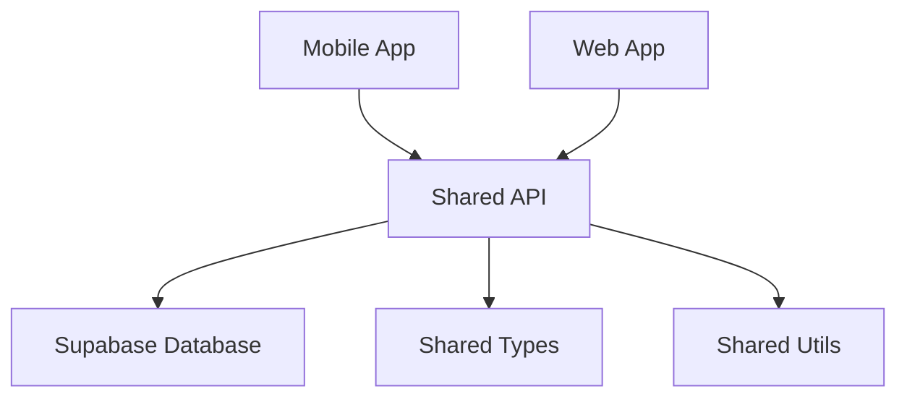

# 📚 Documentação da Modularização - ChefORG

## 🏗️ Arquitetura Modular

O ChefORG foi implementado como um **monorepo** usando **npm workspaces**, proporcionando desenvolvimento unificado com módulos independentes e reutilização máxima de código.

### 🎯 Visão Geral da Estrutura

```
ChefORG/
├── 🌐 web/           # Aplicação Web (React + Vite)
├── 📱 mobile/        # App Mobile (React Native + Expo)  
├── 🔗 shared/        # Lógica Compartilhada
├── 📄 src/           # Legacy (migração em andamento)
└── 🧪 tests/         # Testes Automatizados
```

---

## 🧩 Módulos Principais

### 1. 🌐 **Web Module** (`/web`)
- **Tecnologia**: React 18 + TypeScript + Vite
- **Finalidade**: Interface web para desktop e tablet
- **Porta**: `8110` (configurável)
- **PWA**: Progressive Web App habilitado

**Características:**
- Dashboard administrativo completo
- Interface responsiva para staff
- Sistema de autenticação integrado
- Gestão de mesas, pedidos e reservas

### 2. 📱 **Mobile Module** (`/mobile`)
- **Tecnologia**: React Native + Expo
- **Finalidade**: App móvel para clientes e staff
- **Porta**: `8100` (Expo Metro)
- **Plataformas**: iOS, Android, Web

**Características:**
- QR Code scanner para check-in
- Interface touch-optimizada
- Notificações push
- Câmera integrada

### 3. 🔗 **Shared Module** (`/shared`)
- **Tecnologia**: TypeScript puro
- **Finalidade**: Lógica compartilhada entre web e mobile
- **Porta**: Não aplicável (biblioteca)

**Estrutura:**
```
shared/
├── api/          # Camada de API unificada
├── types/        # Definições TypeScript
├── utils/        # Utilitários cross-platform
├── constants/    # Constantes do sistema
└── ui/           # Componentes UI base
```

---

## 🔄 Comunicação Entre Módulos

### 📡 **API Layer Unificada**

A comunicação entre módulos é centralizada através do **Shared API Layer**:

```typescript
// shared/api/index.ts
export interface ApiResponse<T> {
  data: T;
  error?: string;
  success: boolean;
}

export interface HttpClient {
  get<T>(url: string): Promise<ApiResponse<T>>;
  post<T>(url: string, data?: any): Promise<ApiResponse<T>>;
  // ...
}
```

### 🔗 **Import/Export Pattern**

**Web Module** → **Shared**:
```typescript
// web/src/components/Dashboard.tsx
import { useAuth, ApiClient } from '@cheforg/shared';
import { UserType, Order } from '@cheforg/shared/types';
```

**Mobile Module** → **Shared**:
```typescript
// mobile/src/screens/CheckIn.tsx
import { QRScanner, validateReservation } from '@cheforg/shared';
import { Reservation } from '@cheforg/shared/types';
```

### 🏪 **State Management**

- **Web**: Zustand + React Context
- **Mobile**: React Context + AsyncStorage
- **Shared**: Estado sincronizado via Supabase Realtime

### 📊 **Data Flow**



---

## 🚀 Configuração de Desenvolvimento Local

### 📋 **Pré-requisitos**

```bash
# Node.js 18+ e npm
node --version  # v18.0.0+
npm --version   # v9.0.0+

# Para mobile (opcional)
npx expo-doctor
```

### ⚙️ **Configuração de Portas (8100-8120)**

Todas as portas foram configuradas na faixa **8100-8120** para evitar conflitos:

| Serviço | Porta | Descrição |
|---------|-------|-----------|
| 📱 Mobile (Expo) | `8100` | Metro bundler |
| 🌐 Web (Vite) | `8110` | Servidor de desenvolvimento |
| 🧪 Tests (Playwright) | `8115` | Servidor de testes |
| 📊 Storybook | `8120` | Documentação de componentes |

### 🔧 **Configuração Inicial**

```bash
# 1. Clonar e instalar dependências
git clone <repository-url>
cd ChefORG
npm run install:all

# 2. Configurar variáveis de ambiente
cp .env.example .env
# Editar .env com suas credenciais Supabase
```

---

## ▶️ **Como Iniciar para Desenvolvimento**

### 🎬 **Sequência de Inicialização**

Execute na seguinte ordem para garantir inicialização correta:

#### **1. Iniciar Shared (Verificação)**
```bash
# Validar tipos compartilhados
cd shared
npm run type-check
```

#### **2. Iniciar Web Application**
```bash
# Em terminal separado
npm run dev:web
# ou diretamente:
cd web && npm run dev

# 🌐 Acesso: http://localhost:8110
```

#### **3. Iniciar Mobile Application**
```bash
# Em terminal separado  
npm run dev:mobile
# ou diretamente:
cd mobile && npm run start

# 📱 Acesso: 
# - iOS Simulator: pressione 'i'
# - Android Emulator: pressione 'a'  
# - Web: pressione 'w' (http://localhost:8100)
```

#### **4. Iniciar Testes (Opcional)**
```bash
# MCP Playwright testes
npm run test:mcp

# Componentes 
npm run test:component-analysis
```

### 🔧 **Scripts de Desenvolvimento**

```bash
# === DESENVOLVIMENTO ===
npm run dev              # Inicia web (padrão)
npm run dev:web          # Web explícito  
npm run dev:mobile       # Mobile explícito

# === BUILD ===
npm run build            # Build web
npm run build:web        # Build web explícito
npm run build:mobile     # Build mobile

# === TESTES ===
npm run test             # Testes unitários
npm run test:mcp         # Protocolo MCP completo
npm run test:playwright  # E2E testes
npm run lint             # Linting todos módulos

# === UTILITÁRIOS ===
npm run install:all      # Instalar todas dependências
```

---

## 🔗 **Configurações de Módulos**

### 🌐 **Web Module (vite.config.ts)**

```typescript
export default defineConfig({
  server: {
    port: 8110,
    host: true,
    cors: true
  },
  resolve: {
    alias: {
      '@cheforg/shared': path.resolve(__dirname, '../shared'),
    },
  },
  // PWA, React plugins...
})
```

### 📱 **Mobile Module (app.json)**

```json
{
  "expo": {
    "name": "ChefORG Mobile",
    "slug": "cheforg-mobile", 
    "version": "1.0.0",
    "platforms": ["ios", "android", "web"],
    "web": {
      "bundler": "metro"
    }
  }
}
```

### 🔗 **Shared Module (package.json)**

```json
{
  "name": "@cheforg/shared",
  "exports": {
    ".": "./index.ts",
    "./types": "./types/index.ts", 
    "./api": "./api/index.ts",
    "./utils": "./utils/index.ts",
    "./constants": "./constants/index.ts",
    "./ui": "./ui/index.ts"
  }
}
```

---

## 🛠️ **Resolução de Problemas**

### ❌ **Problemas Comuns**

#### **1. Conflito de Portas**
```bash
# Verificar portas em uso
lsof -i :8100
lsof -i :8110

# Matar processo específico
kill -9 <PID>
```

#### **2. Dependências Desatualizadas**
```bash
# Reinstalar todas dependências
rm -rf node_modules */node_modules 
npm run install:all
```

#### **3. Erro de Alias no Web**
```bash
# Verificar se shared está linkado
ls -la node_modules/@cheforg/

# Re-instalar se necessário
npm install
```

#### **4. Metro/Expo Não Inicia**
```bash
# Limpar cache Expo
npx expo start --clear

# Reset completo
npx expo r -c
```

### 🔧 **Debug Avançado**

```bash
# Logs detalhados
DEBUG=* npm run dev:web
DEBUG=* npm run dev:mobile

# Análise de bundle
npm run build -- --mode=analyze

# Verificar tipos compartilhados
cd shared && npm run type-check -- --noEmit
```

---

## 📈 **Monitoramento de Performance**

### 📊 **Métricas de Desenvolvimento**

```bash
# Build times
time npm run build

# Bundle analysis  
npm run build:web -- --bundle-analyzer

# Test coverage
npm run test:coverage
```

### 🎯 **Benchmarks Esperados**

| Métrica | Web | Mobile | Target |
|---------|-----|--------|--------|
| **Cold Start** | ~2s | ~5s | <3s/<8s |
| **Hot Reload** | ~200ms | ~1s | <500ms/<2s |
| **Build Time** | ~30s | ~60s | <45s/<90s |
| **Bundle Size** | ~800KB | ~2MB | <1MB/<3MB |

---

## 🎯 **Próximos Passos**

### 🚧 **Melhorias Planejadas**

1. **🔄 Migration Completa**: Finalizar migração de `src/` para módulos
2. **📦 Micro-frontends**: Implementar lazy loading entre módulos  
3. **🧪 Testing**: Expandir cobertura de testes para 95%+
4. **⚡ Performance**: Otimização de bundle splitting
5. **🔧 DevOps**: CI/CD pipeline para cada módulo

### 📝 **Checklist de Desenvolvimento**

```markdown
- [ ] Configurar environment (.env)
- [ ] Instalar dependências (npm run install:all)
- [ ] Verificar portas disponíveis (8100-8120)
- [ ] Iniciar web (npm run dev:web)
- [ ] Iniciar mobile (npm run dev:mobile) 
- [ ] Validar shared types (cd shared && npm run type-check)
- [ ] Executar testes (npm run test:mcp)
- [ ] Verificar hot reload funcionando
```

---

## 📞 **Suporte e Documentação**

- **🐛 Issues**: GitHub Issues para bugs
- **💡 Features**: GitHub Discussions para sugestões
- **📚 Docs**: Este arquivo + código comentado
- **🧪 Testes**: `npm run test:mcp` para validação completa

---

*Documentação atualizada em: Dezembro 2024*
*Versão da Arquitetura: v1.0 (Monorepo stable)*