# 📚 Documentação da Modularização - ChefORG

## 🏗️ Arquitetura Modular

O ChefORG foi implementado como um **monorepo** usando **npm workspaces**, proporcionando desenvolvimento unificado com módulos independentes e reutilização máxima de código.

### 🎯 Visão Geral da Estrutura

```
ChefORG/
├── 🌐 web/           # Aplicação Web (React + Vite)
├── 📱 mobile/        # App Mobile (React Native + Expo)
├── 🔗 shared/        # Lógica Compartilhada
├── 📄 src/           # Legacy (migração em andamento)
└── 🧪 tests/         # Testes Automatizados
```

---

## 🧩 Módulos Principais

### 1. 🌐 **Web Module** (`/web`)

- **Tecnologia**: React 18 + TypeScript + Vite
- **Finalidade**: Interface web para desktop e tablet
- **Porta**: `8110` (configurável)
- **PWA**: Progressive Web App habilitado

**Características:**

- Dashboard administrativo completo
- Interface responsiva para staff
- Sistema de autenticação integrado
- Gestão de mesas, pedidos e reservas

### 2. 📱 **Mobile Module** (`/mobile`)

- **Tecnologia**: React Native + Expo
- **Finalidade**: App móvel para clientes e staff
- **Porta**: `8100` (Expo Metro)
- **Plataformas**: iOS, Android, Web

**Características:**

- QR Code scanner para check-in
- Interface touch-optimizada
- Notificações push
- Câmera integrada

### 3. 🔗 **Shared Module** (`/shared`)

- **Tecnologia**: TypeScript puro
- **Finalidade**: Lógica compartilhada entre web e mobile
- **Porta**: Não aplicável (biblioteca)

**Estrutura:**

```
shared/
├── api/          # Camada de API unificada
├── types/        # Definições TypeScript
├── utils/        # Utilitários cross-platform
├── constants/    # Constantes do sistema
└── ui/           # Componentes UI base
```

---

## 🔄 Comunicação Entre Módulos

### 📡 **API Layer Unificada**

A comunicação entre módulos é centralizada através do **Shared API Layer**:

```typescript
// shared/api/index.ts
export interface ApiResponse<T> {
  data: T;
  error?: string;
  success: boolean;
}

export interface HttpClient {
  get<T>(url: string): Promise<ApiResponse<T>>;
  post<T>(url: string, data?: any): Promise<ApiResponse<T>>;
  // ...
}
```

### 🔗 **Import/Export Pattern**

**Web Module** → **Shared**:

```typescript
// web/src/components/Dashboard.tsx
import { useAuth, ApiClient } from '@cheforg/shared';
import { UserType, Order } from '@cheforg/shared/types';
```

**Mobile Module** → **Shared**:

```typescript
// mobile/src/screens/CheckIn.tsx
import { QRScanner, validateReservation } from '@cheforg/shared';
import { Reservation } from '@cheforg/shared/types';
```

### 🏪 **State Management**

- **Web**: Zustand + React Context
- **Mobile**: React Context + AsyncStorage
- **Shared**: Estado sincronizado via Supabase Realtime

### 📊 **Data Flow**


---

## 🚀 Configuração de Desenvolvimento Local

### 📋 **Pré-requisitos**

```bash
# Node.js 18+ e npm
node --version  # v18.0.0+
npm --version   # v9.0.0+

# Para mobile (opcional)
npx expo-doctor
```

### ⚙️ **Configuração de Portas (8100-8120)**

Todas as portas foram configuradas na faixa **8100-8120** para evitar conflitos:

| Serviço               | Porta  | Descrição                   |
| --------------------- | ------ | --------------------------- |
| 📱 Mobile (Expo)      | `8100` | Metro bundler               |
| 🌐 Web (Vite)         | `8110` | Servidor de desenvolvimento |
| 🧪 Tests (Playwright) | `8115` | Servidor de testes          |
| 📊 Storybook          | `8120` | Documentação de componentes |

### 🔧 **Configuração Inicial**

```bash
# 1. Clonar e instalar dependências
git clone <repository-url>
cd ChefORG
npm run install:all

# 2. Configurar variáveis de ambiente
cp .env.example .env
# Editar .env com suas credenciais Supabase
```

---

## ▶️ **Como Iniciar para Desenvolvimento**

### 🎬 **Sequência de Inicialização**

Execute na seguinte ordem para garantir inicialização correta:

#### **1. Iniciar Shared (Verificação)**

```bash
# Validar tipos compartilhados
cd shared
npm run type-check
```

#### **2. Iniciar Web Application**

```bash
# Em terminal separado
npm run dev:web
# ou diretamente:
cd web && npm run dev

# 🌐 Acesso: http://localhost:8110
```

#### **3. Iniciar Mobile Application**

```bash
# Em terminal separado
npm run dev:mobile
# ou diretamente:
cd mobile && npm run start

# 📱 Acesso:
# - iOS Simulator: pressione 'i'
# - Android Emulator: pressione 'a'
# - Web: pressione 'w' (http://localhost:8100)
```

#### **4. Iniciar Testes (Opcional)**

```bash
# MCP Playwright testes
npm run test:mcp

# Componentes
npm run test:component-analysis
```

### 🔧 **Scripts de Desenvolvimento**

```bash
# === DESENVOLVIMENTO ===
npm run dev              # Inicia web (padrão)
npm run dev:web          # Web explícito
npm run dev:mobile       # Mobile explícito

# === BUILD ===
npm run build            # Build web
npm run build:web        # Build web explícito
npm run build:mobile     # Build mobile

# === TESTES ===
npm run test             # Testes unitários
npm run test:mcp         # Protocolo MCP completo
npm run test:playwright  # E2E testes
npm run lint             # Linting todos módulos

# === UTILITÁRIOS ===
npm run install:all      # Instalar todas dependências
```

---

## 🔗 **Configurações de Módulos**

### 🌐 **Web Module (vite.config.ts)**

```typescript
export default defineConfig({
  server: {
    port: 8110,
    host: true,
    cors: true,
  },
  resolve: {
    alias: {
      '@cheforg/shared': path.resolve(__dirname, '../shared'),
    },
  },
  // PWA, React plugins...
});
```

### 📱 **Mobile Module (app.json)**

```json
{
  "expo": {
    "name": "ChefORG Mobile",
    "slug": "cheforg-mobile",
    "version": "1.0.0",
    "platforms": ["ios", "android", "web"],
    "web": {
      "bundler": "metro"
    }
  }
}
```

### 🔗 **Shared Module (package.json)**

```json
{
  "name": "@cheforg/shared",
  "exports": {
    ".": "./index.ts",
    "./types": "./types/index.ts",
    "./api": "./api/index.ts",
    "./utils": "./utils/index.ts",
    "./constants": "./constants/index.ts",
    "./ui": "./ui/index.ts"
  }
}
```

---

## 🛠️ **Resolução de Problemas**

### ❌ **Problemas Comuns**

#### **1. Conflito de Portas**

```bash
# Verificar portas em uso
lsof -i :8100
lsof -i :8110

# Matar processo específico
kill -9 <PID>
```

#### **2. Dependências Desatualizadas**

```bash
# Reinstalar todas dependências
rm -rf node_modules */node_modules
npm run install:all
```

#### **3. Erro de Alias no Web**

```bash
# Verificar se shared está linkado
ls -la node_modules/@cheforg/

# Re-instalar se necessário
npm install
```

#### **4. Metro/Expo Não Inicia**

```bash
# Limpar cache Expo
npx expo start --clear

# Reset completo
npx expo r -c
```

### 🔧 **Debug Avançado**

```bash
# Logs detalhados
DEBUG=* npm run dev:web
DEBUG=* npm run dev:mobile

# Análise de bundle
npm run build -- --mode=analyze

# Verificar tipos compartilhados
cd shared && npm run type-check -- --noEmit
```

---

## 📈 **Monitoramento de Performance**

### 📊 **Métricas de Desenvolvimento**

```bash
# Build times
time npm run build

# Bundle analysis
npm run build:web -- --bundle-analyzer

# Test coverage
npm run test:coverage
```

### 🎯 **Benchmarks Esperados**

| Métrica         | Web    | Mobile | Target     |
| --------------- | ------ | ------ | ---------- |
| **Cold Start**  | ~2s    | ~5s    | <3s/<8s    |
| **Hot Reload**  | ~200ms | ~1s    | <500ms/<2s |
| **Build Time**  | ~30s   | ~60s   | <45s/<90s  |
| **Bundle Size** | ~800KB | ~2MB   | <1MB/<3MB  |

---

## 🕸️ **Grafo de Dependências e Rotas**

### 🎯 **Teoria dos Grafos Aplicada**

O sistema ChefORG implementa um **grafo de dependências direcionado acíclico (DAG)** onde cada módulo representa um **nó** e as dependências representam **arestas direcionadas**.

```mermaid
graph TD
    subgraph "🏗️ CAMADA DE INFRAESTRUTURA"
        DB[(🗄️ Supabase Database)]
        API[🔌 API Layer<br/>12 módulos]
        SHARED[📦 Shared Module<br/>Types + Utils]
    end

    subgraph "🌐 CAMADA DE APLICAÇÃO"
        LEGACY[📱 Legacy App<br/>:8110]
        WEB[🖥️ Web Module<br/>:8110]
        MOBILE[📱 Mobile Module<br/>:8100]
    end

    subgraph "🧪 CAMADA DE TESTES"
        PLAYWRIGHT[🎭 Playwright<br/>:8115]
        MCP[🤖 MCP Tests<br/>All Ports]
        STORY[📚 Storybook<br/>:8120]
    end

    %% Dependências de Infraestrutura
    API --> DB
    SHARED --> API

    %% Dependências de Aplicação
    LEGACY --> SHARED
    LEGACY --> API
    WEB --> SHARED
    WEB --> API
    MOBILE --> SHARED
    MOBILE --> API

    %% Dependências de Testes
    PLAYWRIGHT --> LEGACY
    PLAYWRIGHT --> WEB
    MCP --> LEGACY
    MCP --> WEB
    MCP --> MOBILE
    STORY --> SHARED

    %% Estilos
    classDef infrastructure fill:#e1f5fe,stroke:#01579b,stroke-width:2px
    classDef application fill:#f3e5f5,stroke:#4a148c,stroke-width:2px
    classDef testing fill:#e8f5e8,stroke:#1b5e20,stroke-width:2px

    class DB,API,SHARED infrastructure
    class LEGACY,WEB,MOBILE application
    class PLAYWRIGHT,MCP,STORY testing
```



### 🗺️ **Mapa de Rotas por Módulo**

#### **📍 Rotas Públicas** (Nível 0 - Sem Dependências)

```mermaid
graph LR
    subgraph "🌍 ACESSO PÚBLICO"
        HOME[🏠 / <br/>Homepage]
        MENU[🍽️ /menu <br/>Cardápio Público]
        RESERVA[📅 /reserva <br/>Sistema de Reservas]
    end

    HOME --> AUTH_OPTIONAL[🔓 Auth Opcional]
    MENU --> DB_READ[📖 DB Read-Only]
    RESERVA --> DB_WRITE[✍️ DB Write]
```



#### **📍 Rotas de Cliente** (Nível 1 - Dependem de Validação)

```mermaid
graph LR
    subgraph "👤 EXPERIÊNCIA DO CLIENTE"
        CHECKIN[📱 /checkin <br/>QR Scanner]
        CHEGADA[🚶 /chegada-sem-reserva <br/>Fila Virtual]
        PIN[🔢 /mesa/:id/pin <br/>Autenticação PIN]
        CARDAPIO[🍴 /mesa/:id/cardapio <br/>Menu da Mesa]
        ACOMPANHAR[👀 /mesa/:id/acompanhar <br/>Status do Pedido]
        PAGAMENTO[💳 /mesa/:id/pagamento <br/>Checkout]
        FEEDBACK[⭐ /mesa/:id/feedback <br/>Avaliação]
    end

    CHECKIN --> PIN
    CHEGADA --> PIN
    PIN --> CARDAPIO
    CARDAPIO --> ACOMPANHAR
    ACOMPANHAR --> PAGAMENTO
    PAGAMENTO --> FEEDBACK
```



#### **📍 Rotas Administrativas** (Nível 2 - Dependem de Autenticação + Autorização)

```mermaid
graph LR
    subgraph "🔐 ÁREA ADMINISTRATIVA"
        LOGIN[🔑 /login <br/>Autenticação]
        DASHBOARD[📊 /admin/dashboard <br/>Painel Principal]
        RECEPCAO[🏨 /admin/recepcao <br/>Recepção]
        GARCOM[👨‍🍳 /admin/garcom <br/>Painel Garçom]
        COZINHA[🔥 /admin/cozinha <br/>Painel Cozinha]
        CAIXA[💰 /admin/caixa <br/>Painel Caixa]
        GERENCIA[👔 /admin/gerencia <br/>Gestão]
    end

    LOGIN --> DASHBOARD
    DASHBOARD --> RECEPCAO
    DASHBOARD --> GARCOM
    DASHBOARD --> COZINHA
    DASHBOARD --> CAIXA
    DASHBOARD --> GERENCIA
```



### 🔗 **Matriz de Dependências**

| Módulo/Rota             | Database | API Layer | Auth | Shared | Mobile Metro | Web Server |
| ----------------------- | -------- | --------- | ---- | ------ | ------------ | ---------- |
| **🏠 Homepage**         | ❌       | ❌        | ❌   | ✅     | ❌           | ✅         |
| **🍽️ Menu Público**     | ✅       | ✅        | ❌   | ✅     | ❌           | ✅         |
| **📅 Reservas**         | ✅       | ✅        | ❌   | ✅     | ❌           | ✅         |
| **📱 Check-in QR**      | ✅       | ✅        | ❌   | ✅     | ⚠️           | ✅         |
| **🔢 PIN Mesa**         | ✅       | ✅        | ✅   | ✅     | ❌           | ✅         |
| **🍴 Cardápio Mesa**    | ✅       | ✅        | ✅   | ✅     | ❌           | ✅         |
| **💳 Pagamento**        | ✅       | ✅        | ✅   | ✅     | ❌           | ✅         |
| **👔 Admin Routes**     | ✅       | ✅        | ✅   | ✅     | ❌           | ✅         |
| **📱 Mobile App**       | ✅       | ✅        | ⚠️   | ✅     | ✅           | ❌         |
| **🧪 Playwright Tests** | ✅       | ✅        | ⚠️   | ✅     | ⚠️           | ✅         |

**Legenda:** ✅ Obrigatório | ⚠️ Opcional | ❌ Não Necessário

### 🚀 **Sequências de Inicialização por Cenário**

#### **🔧 Desenvolvimento Web Completo**

```bash
# Ordem obrigatória para desenvolvimento completo
1. npm run dev:web           # Porta 8110 (Principal)
   └── Aguardar: "Local: http://localhost:8110"

2. Verificar APIs funcionando
   └── Testar: curl http://localhost:8110/api/health

3. npm run test:mcp         # Porta 8115 (Testes)
   └── Aguardar: Coverage > 90%
```

#### **📱 Desenvolvimento Mobile**

```bash
# Ordem obrigatória para mobile
1. npm run dev:mobile       # Porta 8100 (Metro)
   └── Aguardar: "Metro Bundler ready"

2. npm run dev:web          # Porta 8110 (APIs)
   └── Aguardar: Backend APIs disponíveis

3. Escolher plataforma:
   └── 'i' para iOS Simulator
   └── 'a' para Android Emulator
   └── 'w' para Web (http://localhost:8100)
```

#### **🧪 Ambiente de Testes Completo**

```bash
# Ordem para cobertura 100%
1. npm run dev:web          # Base APIs
2. npm run dev:mobile       # Mobile bundler
3. npm run test:mcp:complete # Todos os testes
   └── Execução: ~15 minutos
   └── Portas: 8110, 8100, 8115
```

### 🎯 **Algoritmo de Resolução de Dependências**

```javascript
/**
 * Algoritmo para determinar ordem de inicialização
 * Baseado em Ordenação Topológica (Kahn's Algorithm)
 */
const DEPENDENCY_GRAPH = {
  database: [],
  shared: ['database'],
  api: ['database', 'shared'],
  web: ['api', 'shared'],
  mobile: ['api', 'shared'],
  tests: ['web', 'mobile', 'api'],
};

function getStartupOrder(requiredModules) {
  const visited = new Set();
  const result = [];

  function dfs(module) {
    if (visited.has(module)) return;
    visited.add(module);

    // Resolver dependências primeiro
    for (const dependency of DEPENDENCY_GRAPH[module] || []) {
      dfs(dependency);
    }

    result.push(module);
  }

  requiredModules.forEach(dfs);
  return result;
}

// Exemplo de uso:
getStartupOrder(['tests', 'mobile']);
// → ['database', 'shared', 'api', 'web', 'mobile', 'tests']
```

### 🔍 **Validação de Dependências**

#### **🟢 Checklist de Saúde do Sistema**

```bash
#!/bin/bash
# Script: validate-dependencies.sh

echo "🔍 Validando Dependências ChefORG..."

# 1. Verificar portas disponíveis
check_port() {
  if lsof -Pi :$1 -sTCP:LISTEN -t >/dev/null; then
    echo "❌ Porta $1 ocupada"
    return 1
  else
    echo "✅ Porta $1 disponível"
    return 0
  fi
}

# 2. Validar ordem de inicialização
echo "📋 Verificando portas (8100-8120)..."
check_port 8100  # Mobile Metro
check_port 8110  # Web Vite
check_port 8115  # Playwright
check_port 8120  # Storybook

# 3. Testar dependências de módulos
echo "🔗 Testando dependências..."
curl -f http://localhost:8110/health || echo "❌ Web não disponível"
curl -f http://localhost:8100/_health || echo "⚠️ Mobile opcional"

# 4. Verificar shared types
cd shared && npm run type-check || echo "❌ Shared types inválidos"

echo "✅ Validação completa!"
```

#### **🔧 Auto-Resolução de Conflitos**

```bash
# Script automático para resolver conflitos de porta
resolve_port_conflicts() {
  echo "🔧 Resolvendo conflitos de porta..."

  # Matar processos nas portas 8100-8120
  for port in {8100..8120}; do
    pid=$(lsof -ti:$port)
    if [ ! -z "$pid" ]; then
      echo "🚫 Finalizando processo na porta $port (PID: $pid)"
      kill -9 $pid
    fi
  done

  echo "✅ Portas liberadas!"
}
```

---

## 🎯 **Próximos Passos**

### 🚧 **Melhorias Planejadas**

1. **🔄 Migration Completa**: Finalizar migração de `src/` para módulos
2. **📦 Micro-frontends**: Implementar lazy loading entre módulos
3. **🧪 Testing**: Expandir cobertura de testes para 95%+
4. **⚡ Performance**: Otimização de bundle splitting
5. **🔧 DevOps**: CI/CD pipeline para cada módulo

### 📝 **Checklist de Desenvolvimento**

```markdown
- [ ] Configurar environment (.env)
- [ ] Instalar dependências (npm run install:all)
- [ ] Verificar portas disponíveis (8100-8120)
- [ ] Executar resolução de dependências (./validate-dependencies.sh)
- [ ] Iniciar módulos na ordem correta (ver sequências acima)
- [ ] Validar shared types (cd shared && npm run type-check)
- [ ] Executar testes (npm run test:mcp)
- [ ] Verificar hot reload funcionando
```

---

## 📞 **Suporte e Documentação**

- **🐛 Issues**: GitHub Issues para bugs
- **💡 Features**: GitHub Discussions para sugestões
- **📚 Docs**: Este arquivo + código comentado
- **🧪 Testes**: `npm run test:mcp` para validação completa
- **🔍 Debug**: `./validate-dependencies.sh` para diagnóstico

---

_Documentação atualizada em: Dezembro 2024_
_Versão da Arquitetura: v1.1 (Dependency Graph + Route Mapping)_
