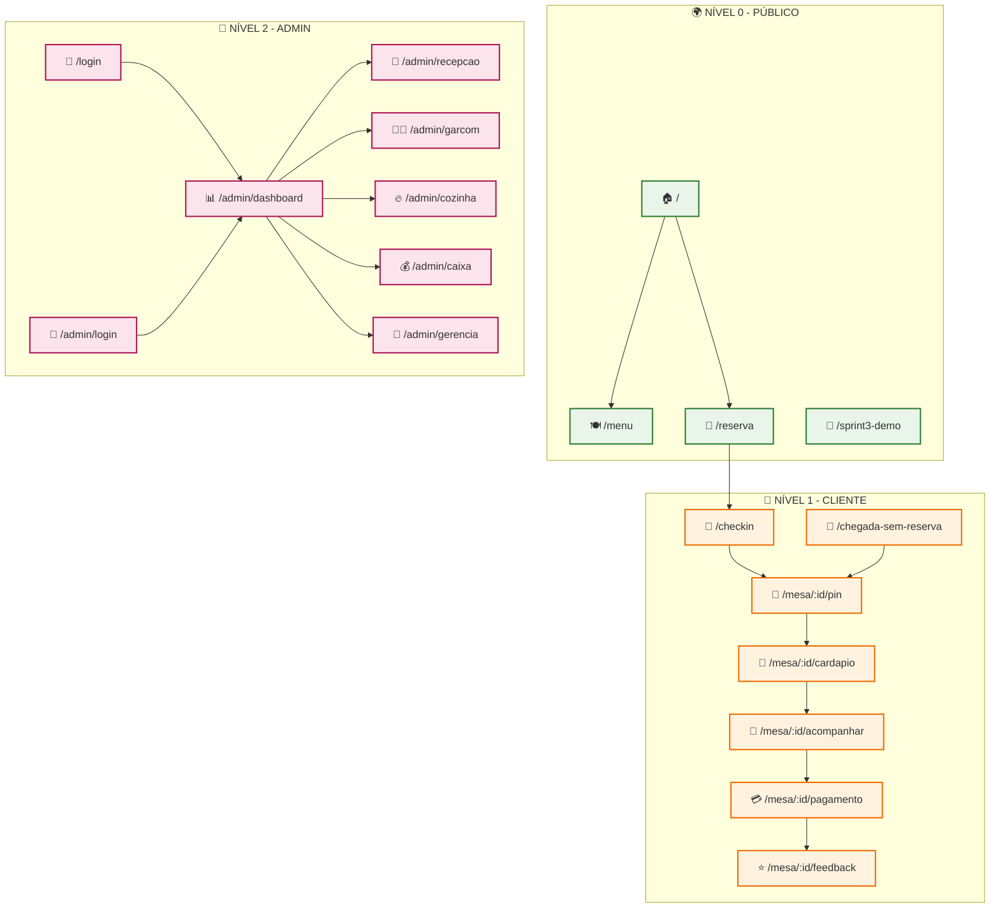
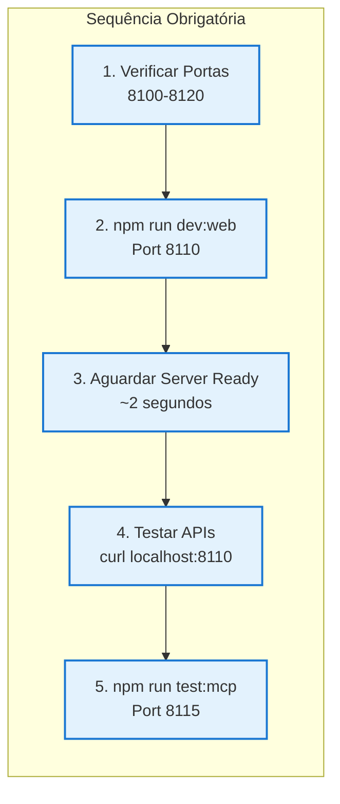
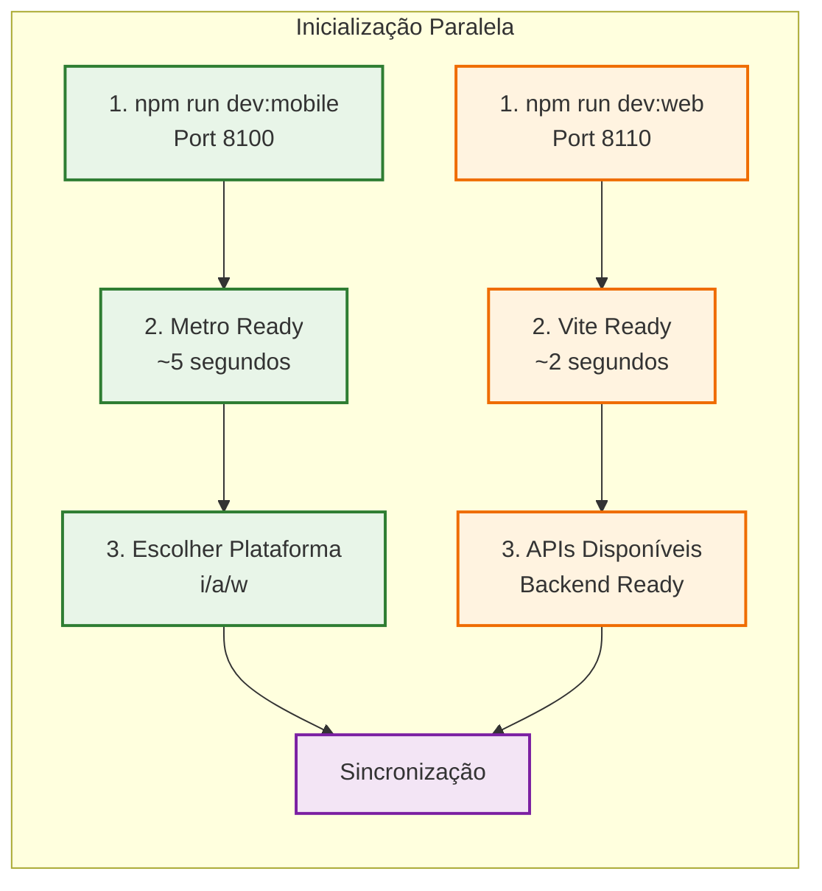
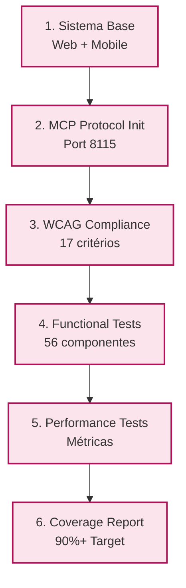
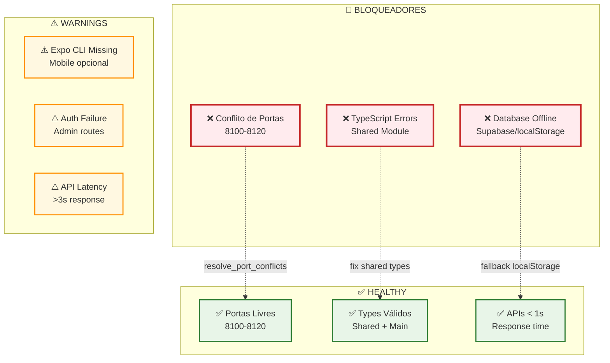
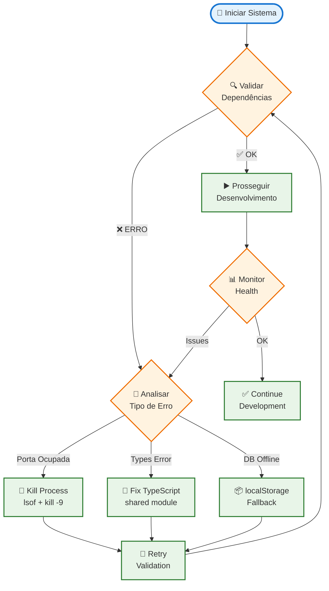

# 🕸️ Grafos de Dependências Visuais - ChefORG

## 📊 Grafo Principal do Sistema

```mermaid
graph TB
    %% Camada de Dados
    subgraph "💾 DATA LAYER"
        DB[(🗄️ Supabase<br/>Database)]
        LS[📦 localStorage<br/>Fallback]
        COMPAT[🔧 Compatibility<br/>Layer]
    end
    
    %% Camada de API
    subgraph "🔌 API LAYER"
        AUTH_API[🔐 auth.ts]
        ORDER_API[🛒 orders.ts]
        MENU_API[🍽️ menu.ts]
        RES_API[📅 reservations.ts]
        PAY_API[💳 payments.ts]
        TABLE_API[🪑 tables.ts]
        FEED_API[⭐ feedback.ts]
        DASH_API[📊 dashboard.ts]
        NOTIF_API[📱 notifications.ts]
        STOCK_API[📦 stock.ts]
        LOYAL_API[🎁 loyalty.ts]
        REP_API[📈 reports.ts]
    end
    
    %% Camada Compartilhada
    subgraph "🔗 SHARED LAYER"
        TYPES[📋 Types]
        UTILS[🛠️ Utils]
        CONSTANTS[⚙️ Constants]
        UI_SHARED[🎨 UI Components]
    end
    
    %% Camada de Aplicação
    subgraph "🌐 APPLICATION LAYER"
        LEGACY[📱 Legacy App<br/>Port 8110]
        WEB[🖥️ Web Module<br/>Port 8110]
        MOBILE[📱 Mobile Module<br/>Port 8100]
    end
    
    %% Camada de Testes
    subgraph "🧪 TESTING LAYER"
        PLAYWRIGHT[🎭 Playwright<br/>Port 8115]
        MCP[🤖 MCP Protocol<br/>All Ports]
        COMPONENT[🧩 Component Tests]
    end
    
    %% Dependências de Dados
    DB --> COMPAT
    LS --> COMPAT
    
    %% Dependências de API
    COMPAT --> AUTH_API
    COMPAT --> ORDER_API
    COMPAT --> MENU_API
    COMPAT --> RES_API
    COMPAT --> PAY_API
    COMPAT --> TABLE_API
    COMPAT --> FEED_API
    COMPAT --> DASH_API
    COMPAT --> NOTIF_API
    COMPAT --> STOCK_API
    COMPAT --> LOYAL_API
    COMPAT --> REP_API
    
    %% Dependências Shared
    AUTH_API --> TYPES
    ORDER_API --> TYPES
    MENU_API --> TYPES
    RES_API --> TYPES
    PAY_API --> TYPES
    TABLE_API --> TYPES
    TYPES --> UTILS
    UTILS --> CONSTANTS
    
    %% Dependências de Aplicação
    LEGACY --> AUTH_API
    LEGACY --> ORDER_API
    LEGACY --> MENU_API
    LEGACY --> RES_API
    LEGACY --> PAY_API
    LEGACY --> TABLE_API
    LEGACY --> FEED_API
    LEGACY --> DASH_API
    LEGACY --> TYPES
    LEGACY --> UTILS
    LEGACY --> UI_SHARED
    
    WEB --> TYPES
    WEB --> UTILS
    WEB --> UI_SHARED
    
    MOBILE --> TYPES
    MOBILE --> UTILS
    MOBILE --> UI_SHARED
    
    %% Dependências de Testes
    PLAYWRIGHT --> LEGACY
    PLAYWRIGHT --> WEB
    MCP --> LEGACY
    MCP --> WEB
    MCP --> MOBILE
    COMPONENT --> UI_SHARED
    
    %% Estilos
    classDef dataLayer fill:#e3f2fd,stroke:#1976d2,stroke-width:2px
    classDef apiLayer fill:#fff3e0,stroke:#f57c00,stroke-width:2px
    classDef sharedLayer fill:#f3e5f5,stroke:#7b1fa2,stroke-width:2px
    classDef appLayer fill:#e8f5e8,stroke:#388e3c,stroke-width:2px
    classDef testLayer fill:#fce4ec,stroke:#c2185b,stroke-width:2px
    
    class DB,LS,COMPAT dataLayer
    class AUTH_API,ORDER_API,MENU_API,RES_API,PAY_API,TABLE_API,FEED_API,DASH_API,NOTIF_API,STOCK_API,LOYAL_API,REP_API apiLayer
    class TYPES,UTILS,CONSTANTS,UI_SHARED sharedLayer
    class LEGACY,WEB,MOBILE appLayer
    class PLAYWRIGHT,MCP,COMPONENT testLayer
```



## 🗺️ Grafo de Rotas por Nível de Acesso



## 🔄 Grafo de Inicialização por Cenário

### 📱 Cenário 1: Desenvolvimento Web Completo



### 📲 Cenário 2: Desenvolvimento Mobile + Web



### 🧪 Cenário 3: Testes Completos (90%+ Coverage)



## ⚡ Matriz de Dependências Críticas



## 🎯 Algoritmo de Resolução Automática



## 📋 Comandos de Validação

```bash
# Validação completa do sistema
npm run validate:dependencies

# Resolução automática de conflitos
npm run validate:ports

# Help e documentação
npm run validate:help

# Execução manual do script
./validate-dependencies.sh
./validate-dependencies.sh --resolve-ports
./validate-dependencies.sh --help
```

---

*Gerado automaticamente pela análise de dependências do ChefORG*
*Versão: v1.1 - Dezembro 2024*